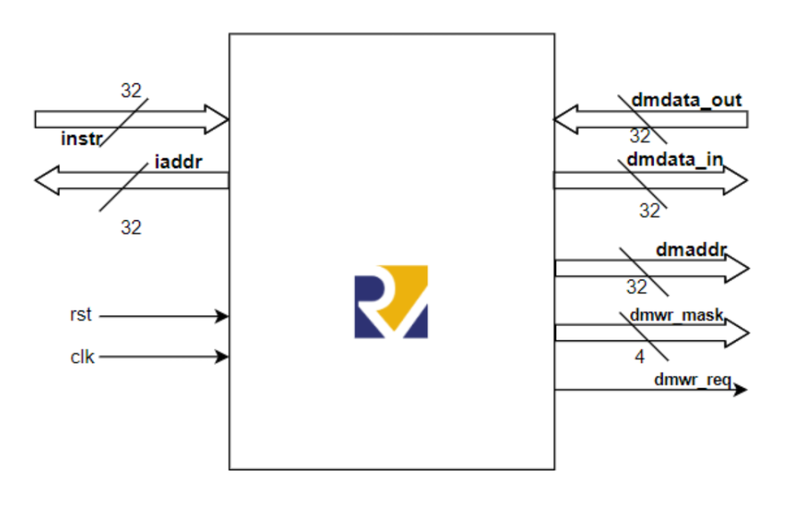
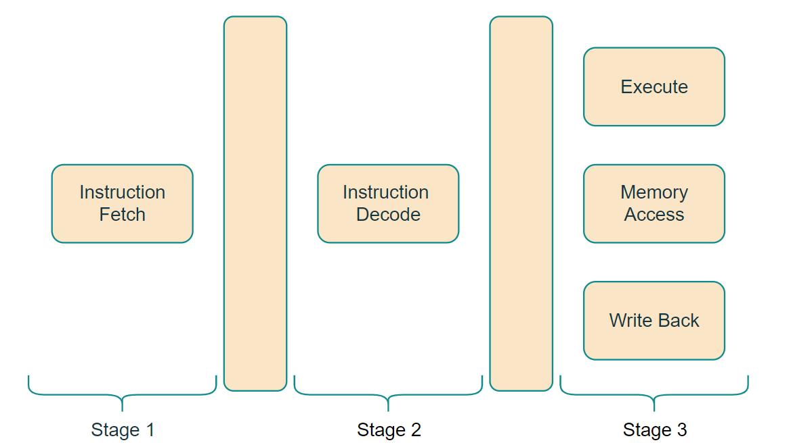
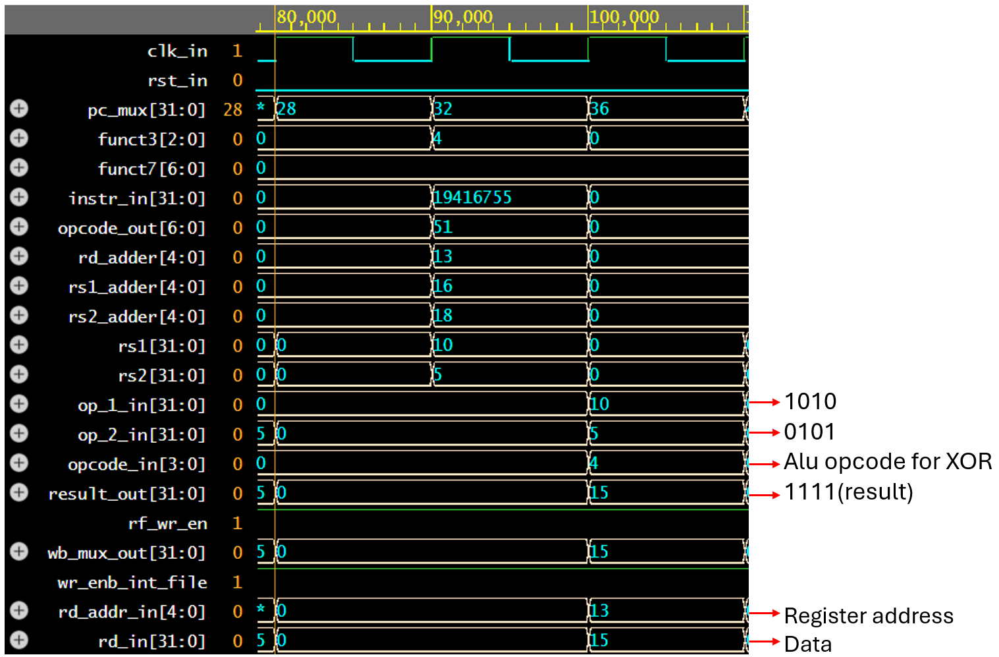
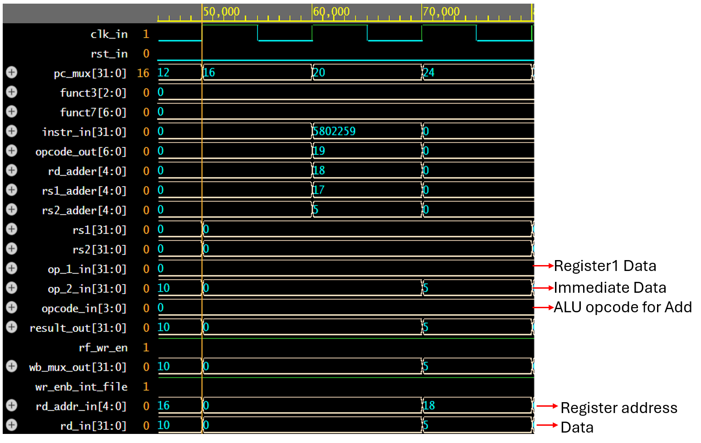
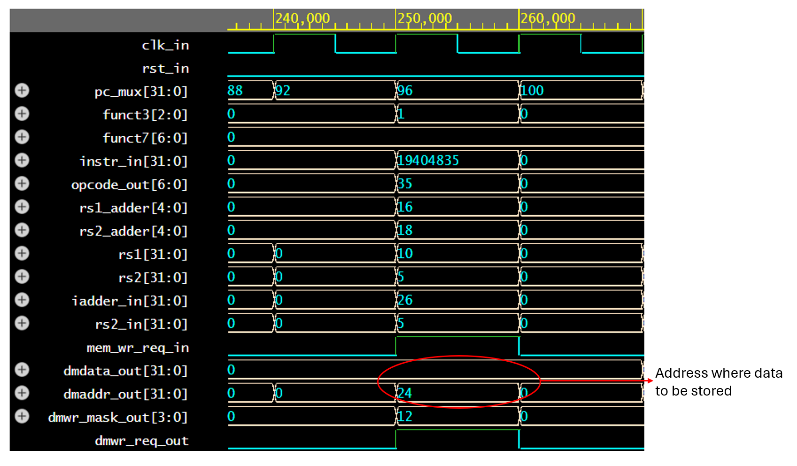
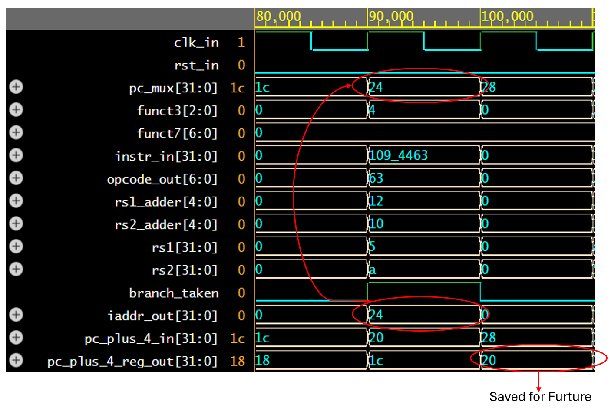

# Final Capstone Project- STRV32I (SURE Trust RISC-V Processor)

#### Overview
This repository contains the design and implementation of a RISC-V processor based on the RV32I instruction set architecture. The processor is capable of executing basic integer instructions as specified by the RISC-V ISA.

## Contents
    Problem Statement
    Interface Details
    Deliverables
    Processor Features
    Implementation Details
    Testing


## Problem Statement
Design a 3-stage pipelined RISC-V processor that works on RV32I ISA- STRV32I.
<p align="center">
  
</p>

## Interface Details

#### General Interface:
- `clk_in`    : System clock input (10MHz).
- `rst_in`    : Synchronous system reset input (active high).

#### Instruction Cache Interface:
- `imaddr_out`    : 32-bit target address output to the instruction cache.
- `instr_in`      : 32-bit instruction input fetched from the instruction cache.

#### Data Cache Interface:
- `dm_wr_req_out`  : Write request signal output to the data cache. High indicates a write request, low indicates a read request.
- `dm_addr_out`    : 32-bit target (read/write) address output to the data cache.
- `dm_data_in`     : 32-bit data input read from the data cache during load operations.
- `dm_data_out`    : 32-bit data output to be written to the data cache during store operations.
- `dm_wr_mask_out` : 4-bit mask signal output that determines the bits to be masked during data cache write operations.

## Deliverables

- **Performance Analysis**:               Clock cycle count, throughput, and latency for various instructions and instruction sequences.
- **Pipeline Diagram**:                   Illustration of pipeline stages and instruction flow.
- **Hazard Detection and Resolution**:    Explanation of data hazards, control hazards, and structural hazards detection and mitigation.
- **Memory Subsystem**:                   Description of memory access handling, including memory hierarchy and cache structure.
- **Forwarding and Stall Mechanisms**:    Description of data forwarding and stall mechanisms for maintaining correct instruction execution.
- **Exception Handling**:                 Explanation of how exceptions, interrupts, traps, and system calls are handled.
- **Verification Plan**:                  Methodology and tools used for verifying the correctness of the processor design.

### Pipeline
A pipeline in computer architecture is a method used to enhance processor performance by breaking down the execution of instructions into smaller, sequential stages. This allows multiple instructions to be processed simultaneously, improving throughput and overall efficiency.

In the context of pipeline processing, the implementation under consideration utilizes a three-stage pipeline configuration, where each stage operates within a distinct clock cycle of 100ns duration. This contrasts with the single-cycle approach, where the entirety of an instruction's execution is completed within a single clock cycle lasting 300ns.


### Performance Analysis
- For Single Cycle

      Number of cycle for 1 instruction = 1

      Time period of 1 cycle = 300 ns

      Time taken to complete 1 instruction = 1 x 300 ns = 300 ns 

- After pipelining

      Number of Clock cycle taken in 3 staged pipelining for 5 Instructions = 7 Clock cycles

      Clock Per Instruction (CPI) = 7/5 = 1.4

      Time taken to complete 1 instruction = 1.4 x 10ns = 14ns 

<p align="center">
  
</p>


## Directory Structure
```
├───Images
├───RTL_codes
└───Testbench
```
- Images:     It contains all the image file used in `README.md`.
- RTL_codes:  It contains all the verilog source code used in this project.
  It contains the following files.

- Testbench:  It contains the system verilog file used while testing the processor.

### Block-wise Details

#### 1. PC Unit
- Decides the next PC value.
- Resets PC value on reset.
- Generates new PC value for branch or jump instructions.

#### 2. Reg Block 1
- Synchronizes signals from stage 1 to stage 2.

#### 3. Immediate Generator
- Generates immediate values for branch and jump instructions.

#### 4. Immediate Adder
- Adds the PC value with the immediate value to generate a new PC value.

#### 5. Write Enable Generator
- Generates write enable signals for register file access.

#### 6. Integer File
- Contains 32 general-purpose registers.
- Supports read and write operations.

#### 7. Instruction MUX
- Selects between flushed instructions and core instructions.

#### 8. Decoder
- Decodes instructions and generates control signals.

#### 9. Branch Unit
- Determines if a branch instruction should be taken.

#### 10. Control Unit
- Manages processor states and flushes PC value for branch and jump instructions.

#### 11. Store Unit
- Drives signals for interfacing with external data memory.

#### 12. Reg Block 2
- Registers inputs and produces outputs for stage 3.

#### 13. ALU (Arithmetic Logic Unit)
- Performs arithmetic and logical operations on two 32-bit operands.

#### 14. Load Unit
- Reads data from data memory and forms a 32-bit value based on load size.

#### 15. WB Mux (Write Back Multiplexer)
- Selects the value to be written back into the register file.


## Processor Features
- RV32I Instruction Set Support: Implements the base integer instruction set architecture defined by RISC-V.
- Pipelined Architecture: Utilizes a pipelined architecture for improved performance.
- Memory Hierarchy: Supports instruction and data memory for program execution and data storage.
- Basic ALU Operations: Supports basic arithmetic and logical operations including addition, subtraction, AND, OR, XOR, etc.

## Implementation Details
- The processor is implemented in Verilog HDL.
- It consists of several modules including instruction fetch, decode, execute, memory access, and write back.
- The design follows the RV32I instruction set architecture specifications provided by the RISC-V Foundation.

## Testing
- Testbench files are provided in the `testbench` directory to verify the functionality of the processor.
- Test programs written in assembly language can be executed on the processor to validate its behavior.

### R-Type Instructions 
R-type instructions involve operation between two operands stored in two on-chip registers. The fetched instruction should provide the address to the two operands and help the processor to decode the type of operation to be performed.

-   Instruction: xor x13, x16, x18
-   Description: The contents of register x16 and x18 are to be xored and stored back to the x13 register.
    As per the ISA,
    - Hex equivalent:  012846b3 
    - Bin equivalent:  00000001001010000100011010110011 
    - Opcode:          0110011
    - func3:           3'b100
    - func7:           7'b000_0000
    - rsl addr:         5'b10000
    - rs2_addr:         5'b10010
    - rd addr:          5'b01101

<p align="center">
  
</p>

### I-Type Instructions 
The I-Type instructions  are used for immediate value operations. These instructions operate on data stored in registers and an immediate value (often a constant or offset).

-   Instruction: addi x18, x17, 5
-   Description: The content of register x17 and immediate data 5 are to be added and stored back to the x18 register.
    As per the ISA,
    - Hex equivalent:  01488813 
    - Bin equivalent:  00000001010010001000100000010011
    - Opcode:          0010011
    - func3:           3'b000
    - func7:           7'b000_0000
    - rsl addr:        5'b10001
    - imm data:        12'b000000010100
    - rd addr:         5'b10000

<p align="center">
  
</p>

### S-Type Instructions 
S-Type instructions in the RV32I instruction set architecture are used for storing data into memory. These instructions involve operations such as storing a byte, halfword, or word into memory at a specified address.

-   Instruction: sh x18, 16(x16)
-   Description: Store Word - Store value in x18 at address 16 bytes ahead of x16
    As per the ISA,
    - Hex equivalent:  01281823 
    - Bin equivalent:  00000001001010000001100000100011
    - Opcode:          0100011
    - func3:           3'b001
    - func7:           7'b000_0000
    - rsl addr:        5'b10000
    - imm data:        12'b000000010000
    - rs2 addr:         5'b10010

<p align="center">
  
</p>

### B-Type Instructions 
B-Type instructions in the RV32I instruction set architecture (ISA) of RISC-V are branch instructions. These instructions are used to perform conditional jumps based on the result of a comparison between two registers.

-   Instruction: blt x18, x16, 8
-   Description: Branch if Less Than - Branch to PC+8 if x18 < x16
    As per the ISA,
    - Hex equivalent:  01094463 
    - Bin equivalent:  00000001000010010100010001100011
    - Opcode:          1100011
    - func3:           3'b100
    - func7:           7'b000_0000
    - rsl addr:        5'b10010
    - imm data:        12'b000000000100
    - rs2 addr:         5'b10000

<p align="center">
  
</p>

### J-Type Instructions 
J-Type instructions are jump instructions that involve unconditional or conditional branching. These instructions allow the program to alter the flow of execution by jumping to a different memory address.

-   Instruction: jalr x12, x16, 0
-   Description: Jump and Link Register: Jump to the address in x16 and set x12 to the address of the next instruction
    - Hex equivalent:  00080667 
    - Bin equivalent:  00000000000010000000011001100111
    - Opcode:          1100111
    - func3:           3'b000
    - rsl addr:        5'b01100
    - imm data:        19'b0000100000000000000

<p align="center">
  
</p>